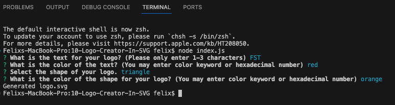

# 10 Logo Generator  [](https://opensource.org/licenses/MIT)

## User Story

```md
AS a freelance web developer
I WANT to generate a simple logo for my projects
SO THAT I don't have to pay a graphic designer
```

## Description

This logo generator application allows users to generate custom, quality logos using command-line application. The user can adjust the following properties of the logo: 1-3 character text (centered) in a shape, the color of the text, shapes (consisting of circle, triangle, square), and the color of the shape.

This will allow project creators to independently generate logos without needing the professional help of a graphic designer.

The application will be invoked by using the following command:

```bash
node index.js
```

GitHub repo link: https://github.com/dahfefe/10-Logo-Creator-In-SVG

## Motivation
  
To enable the developer community have access to a logo generating tool to become more independent and less reliant on outsourced help for graphic design needs. 

## Problem Solved
  
Developers and project creators can avoid the need to hire a graphic design specialist for logo creation. 

## What I Learned
  
I became better familiarized with node.js in relation to Inquirer package for utilizing command-line prompts. Additionally, I gained a better understanding of utilizing node.js functionality to apply user inputs to markdown files like README.md. Lastly, I enhanced my understanding of testing processes via Jest to ensure proper functionality of Javascript code. 

## Table of Contents

- [Installation](#installation)
- [Usage](#usage)
- [Credits](#credits)
- [License](#license)
- [Features](#features)
- [How to Contribute](#contributing)
- [Any Questions?](#questions)

## Installation 
  
1) Visit my GitHub repo for required code: https://github.com/dahfefe/10-Logo-Creator-In-SVG
2) Using SSH key from the repository, clone down the repo to your desired directory. 
3) Open the cloned repository using your code editor of choice. 
4) Ensure there is a `.gitignore` file that includes `node_modules/` and `.DS_Store/` so that your `node_modules` directory isn't tracked or uploaded to GitHub, in the event you wish to fork this repository. Be sure to create your `.gitignore` file before installing any npm dependencies.
5) Make sure that your repo includes a `package.json` with the required dependencies. You can create one by running `npm init` when you first set up the project, before installing any dependencies.
6) Run "npm install inquirer@8.2.4" in the terminal to install the required Inquirer package at the proper version. 

## Usage

The main case use for this project include the following:
1) To custom generate a logo file in SVG format based on command-line user inputs

## Screenshot & Video Tutorial of Application

Video Tutorial: https://watch.screencastify.com/v/adsuAFAfi15uxnn02omE

When initially starting the application, open the terminal and run "node index.js":


When the command is ran, user will be directed by command-line prompts. Follow the prompts to apply features to your custom logo:


Once the user has answered all prompts, the terminal input should appear like the following and a message stating "Generated logo.svg" should appear:



An svg file will generate and you can open this file in the browser in order to view your custom-made logo:


## Credits

[Inquirer package](https://www.npmjs.com/package/inquirer/v/8.2.4)

## License [](https://opensource.org/licenses/MIT)

This project is licensed under the [MIT License](https://opensource.org/license/mit). You can find the license details in the LICENSE file included in this repository.

## Features
  
Dependency: [Inquirer package](https://www.npmjs.com/package/inquirer/v/8.2.4)

## Contributing

There are many ways in which you can participate in this project, for example:

* [Submit bugs and feature requests](https://github.com/dahfefe/10-Logo-Creator-In-SVG/issues), and help us verify as they are checked in
* Review [source code changes](https://github.com/dahfefe/10-Logo-Creator-In-SVG/pulls)
* Review the [documentation](https://github.com/microsoft/vscode-docs) and make pull requests for anything from typos to additional and new content

## Questions
  
Link to My GitHub: https://github.com/dahfefe

If you should have any questions, you can contact me at the following email address: fsmunozteng@gmail.com